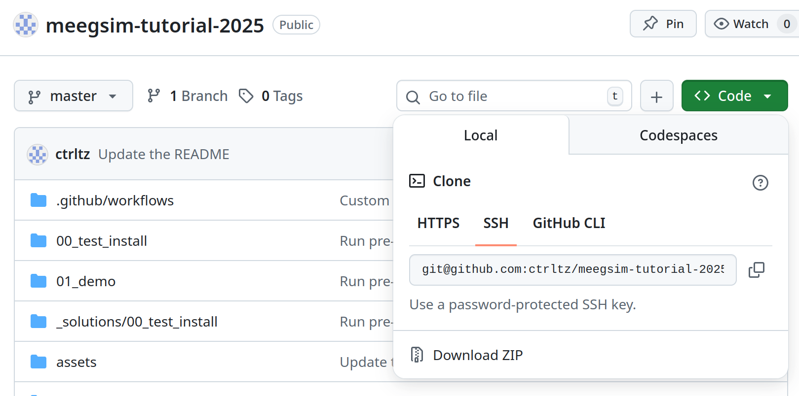

# Intro to MEEGsim

This repository contains the materials of the workshop on how to use the MEEGsim package for simulating ground-truth M/EEG activity and connectivity patterns. The workshop will be hosted as part of the [Toolbox Bouquet](https://cuttingeeg.org/practicalmeeg2025/bouquet/) session (30.10.2025, 2-5 pm CET) at the [PracticalMEEG'25](https://cuttingeeg.org/practicalmeeg2025/) conference.

## Authors

[Nikolai Kapralov](https://bsky.app/profile/willenjoy.bsky.social) and [Alina Studenova](https://bsky.app/profile/studenova.bsky.social), Max Planck Institute for Human Cognitive and Brain Sciences, Leipzig, Germany

## Schedule

The schedule is tentative and may be adjusted to make the pace comfortable for the participants.

* before the workshop: Please [prepare for the workshop](#preparing-for-the-workshop) in advance (`00_test_install`)

* 2:30pm - 2:50pm: Short intro to simulations - why, what, how? [[slides](https://drive.google.com/file/d/1JwOkb5sQiSYHdQd2WqxGxO-CQ7xeuEl1/view?usp=sharing)]

* 2:50pm - 4:00pm: Going together through the demo script / Jupyter notebook (`01_demo`) to learn about the features MEEGsim provides

* 4:00pm - 5:00pm: Hands-on part (`02_hands_on`) - use MEEGsim to illustrate neurophysiological- / signal-processing-related phenomena with simulations

## Folder structure

The following folders contain the materials of the workshop:

* `00_test_install`: small notebook/script for testing that all packages were installed properly when [preparing for the workshop](#preparing-for-the-workshop)
* `01_demo`: notebook/script that will be discussed during the demo part of the workshop
* `02_hands_on`: notebooks/scripts with exercises for the hands-on part of the workshop:
    * `noise_bursts`: show that threshold-based methods detect oscillatory bursts even if the brain only shows 1/f-activity
    * `patch_cancellation`: investigate and visualize how the leadfield of a patch source changes depending on its area
    * `snr_connectivity`: show that the estimated connectivity may depend on the signal-to-noise ratio of the oscillatory activity
    * `std_alpha`: learn how to make simulations more realistic using variance of source activity derived from real data
* `_solutions`: suggested solutions for the `FILL_ME` parts of the scripts (sometimes, just one of the many possible options)
* `src/meegsim_tutorial`: helper functions that are used in the notebooks/scripts (feel free to check their code if you want to understand them better but this should not be necessary to follow)

## Preparing for the workshop

1. [Clone](https://docs.github.com/en/repositories/creating-and-managing-repositories/cloning-a-repository)/[fork](https://docs.github.com/en/pull-requests/collaborating-with-pull-requests/working-with-forks/fork-a-repo?versionId=free-pro-team%40latest&productId=repositories&restPage=creating-and-managing-repositories%2Ccloning-a-repository) the repository to your PC or download its contents ("Download ZIP" in the screenshot below). If you decide to clone the repository and want to commit your changes, consider doing that in a separate branch to always be able to pull the latest changes (e.g., bugfixes).



2. Change your current working directory to the directory of this repository, e.g., via the command below right after cloning the repo:

    ```
    cd meegsim-tutorial-2025
    ```

3. [Optional, but recommended] Create an **empty** environment of your preference (
    [conda](https://docs.conda.io/projects/conda/en/latest/user-guide/tasks/manage-environments.html) |
    [venv](https://docs.python.org/3/library/venv.html) |
    [uv](https://docs.astral.sh/uv/) |
    etc.) to have no conflicts with other packages installed on your system. Activate the environment.

4. Use the following command to install all prerequisites for the workshop:

    ```bash
    pip install -e .
    ```

5. Depending on your selection in step 2, open either the Python script
`00_test_install/test_install.py` or the `00_test_install/test_install.ipynb` notebook. Both the script and the notebook require you to set the path to the directory where the sample data should be stored. In this and all other scripts, parts of the script where your input is expected are marked with `FILL_ME`. Set the path and run the script / all cells of the notebook.

    **NOTE:** On Windows, you might need to run the Python script using `python -X utf8 00_test_install/test_install.py` to ensure that all symbols are displayed correctly.

6. If you see "✅ Everything seems to work!" in the output, all necessary packages were installed correctly, and you're well prepared for the main part of the workshop! If any errors occurred, feel free to contact the workshop instructors.
